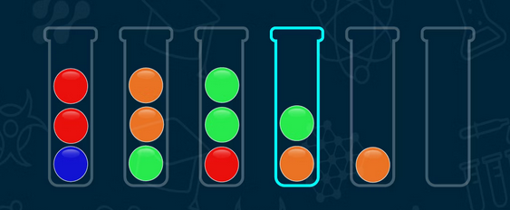

<h1 align="center"> FelipedelosH </h1>
 
<h4>TikTok Bubble Sort and others sorts</h4>

 
:construction: Status of projecgitt :construction:
  
I try to see with my eyes how to do sort algorithms

## :hammer:Funtions:

- `Brute Bubble Sort`: Try to order arr with bubble sort not optimal 
- `Optima Bubble Sort`: Try to order arr with bubble sort optimal 

## :play_or_pause_button:How to execute a project

Double click in main.py

## :hammer_and_wrench:Tech.

- Python
- Tkinter

## :warning:Warning.

- In construction.

## Autor

| [ Andrés Felipe Hernánez](https://github.com/felipedelosh)|
| :---: |